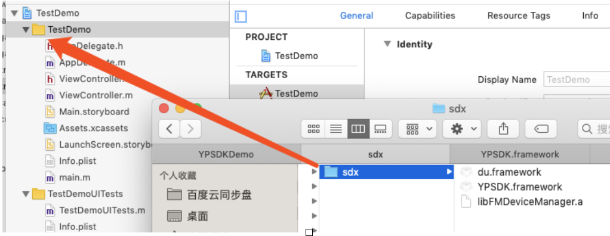
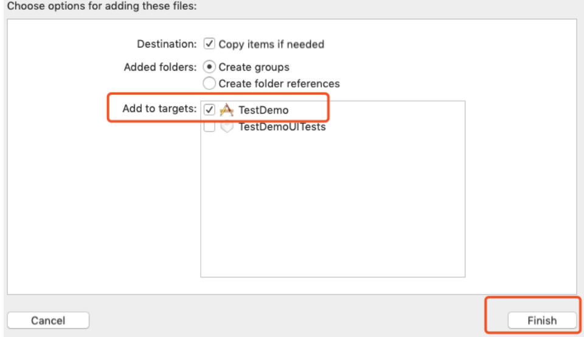
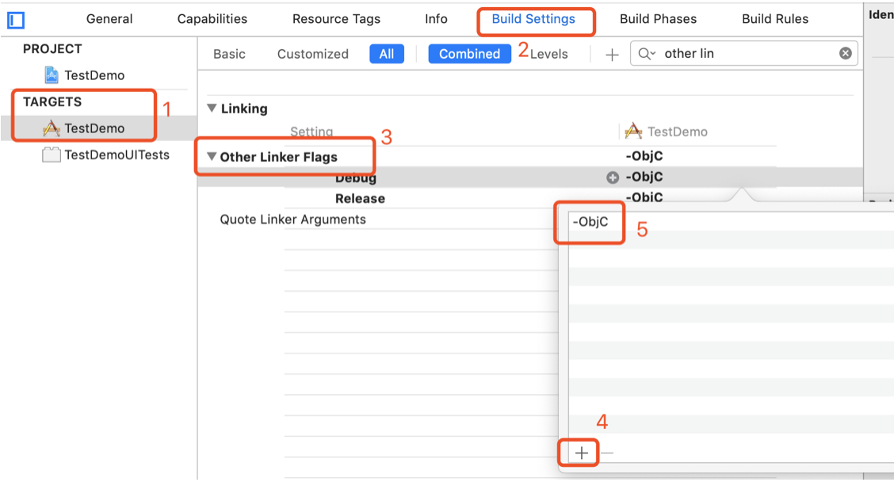
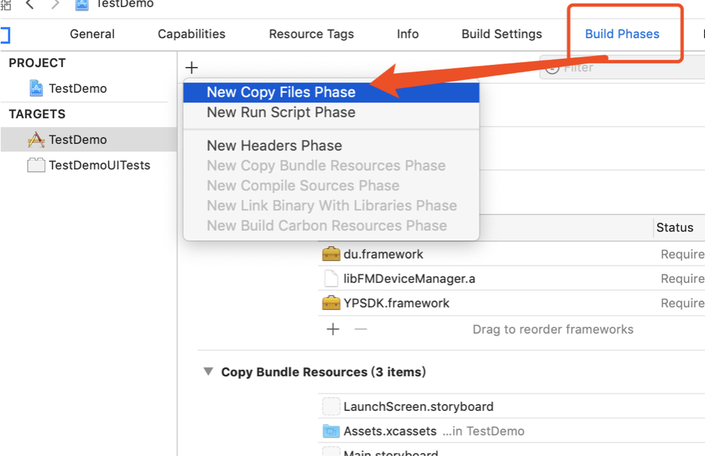
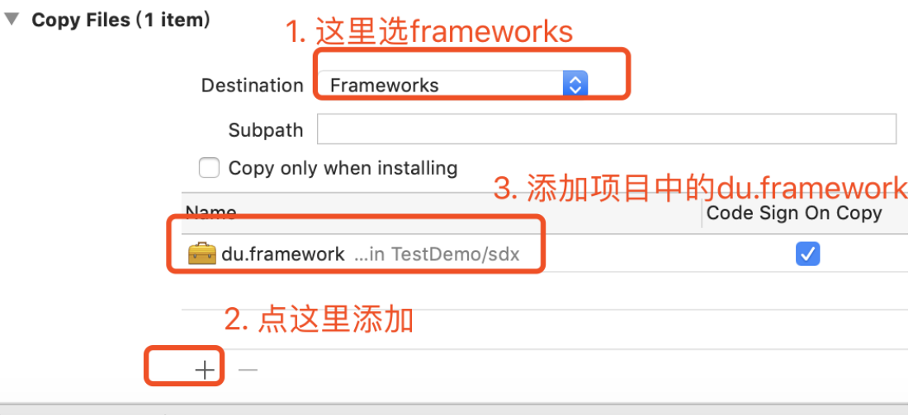
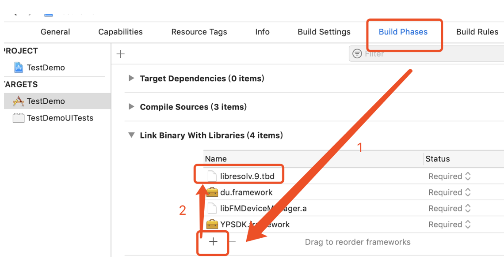
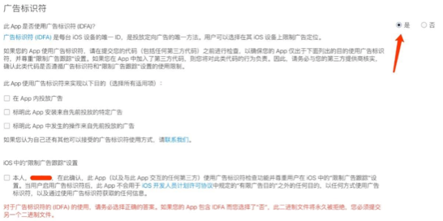

# YPSDK
云加金融科技分期小贷业务SDK

## 接入方式

云加分期小贷业务提供两种接入方式: Cocoapod 接入和手动接入

#### Cocoapod 接入

Podfile 文件中添加：

> pod 'YPSDK'

命令行执行: pod install

#### 手动接入

**下载Framework**

下载代码仓库，并解压YPSDK.zip，得到du.framework，libFMDevicManager.a，YPSDK.framework三个文件。

**加入工程，添加编译链接、设置编译flag依赖库**

将sdk压缩包解压后，直接将sdk目录添加到项目中


注意要选择加入到项目的target中


在“order Linker Flags”中添加 -ObjC


Copy du.framework


按下图的步骤添加du.framework：


导入libresolv.9.tbd 依赖库


## API及使用方式

SDK 只包含两类API，初始化启动API和业务唤起API。

添加头文件

> #import "YPSDK/YPSDX.h"

#### SDK 初始化启动

1. debug 模式初始化

```
+ (void)startSDKDebugMode;
```
2. release 模式初始化

```
+ (void)startSDK;
```

添加头文件，并在 didFinishLaunchingWithOptions 内添加SDK初始化启动代码。
```
- (BOOL)application:(UIApplication *)application didFinishLaunchingWithOptions:(NSDictionary *)launchOptions {
#ifdef DEBUG
    [YPSDX startSDKDebugMode];
#else
    [YPSDX startSDK];
#endif
  .....
}
```

#### SDK 业务唤起
```
/**
 导航至SDK相关页面

 @param URL 页面对应URL(由云加提供)
 @param returnURL 页面对应returnURL(由云加提供)
 @param navi 导航控件(App内的导航控件)
 @param success sdk操作成功后回调(比如支付接口，则表示支付成功）
 @param failure sdk操作失败回调(比如支付接口，则表示支付失败）
 */
+ (void)actionWithURL:(nonnull NSString *)URL
            returnURL:(nullable NSString *)returnURL
           navigation:(nullable UINavigationController *)navi
              success:(nullable void (^)(NSDictionary *response))success
              failure:(nullable void (^)(NSDictionary *response, NSError *error))failure;
 ```
在合适的地方添加调用业务唤起API

用例：
```
NSString *url = @"https://www.baidu.com";
[YPSDX actionWithURL: url
           returnURL: nil
          navigation: nil
             success: ^(NSDictionary *response) {
                  NSLog(@"success");
             } failure:^(NSDictionary *response, NSError *error) {
                  NSLog(@"failed: %@", error);
             }];

```

## 权限配置

由于SDK内部页面需使用摄像头、通讯录、定位、相册，所以需要在项目Info.plist中添加权限申请描述。


也可直接Copy：

```
<key>NSMicrophoneUsageDescription</key>
<string>App需要您的同意,才能录制视频</string>
<key>NSCameraUsageDescription</key>
<string>App需要您的同意,才能使用摄像头</string>
<key>NSPhotoLibraryUsageDescription</key>
<string>App需要您的同意,才能读取媒体资料库</string>
<key>NSLocationWhenInUseUsageDescription</key>
<string>App需要您的同意,才能访问定位</string>
<key>NSContactsUsageDescription</key>
<string>App需要您的同意,才能访问通讯录</string>
```

## 审核注意事项

由于 SDK 使用了 IDFA，所以在应用在上架 App Store 时，请务必选择使用 IDFA，勾选确认，如图所示: 

